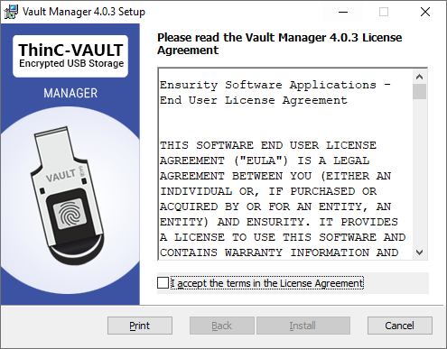
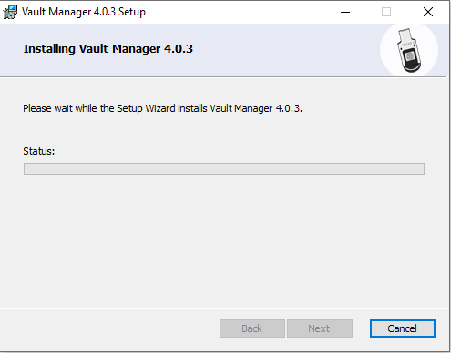
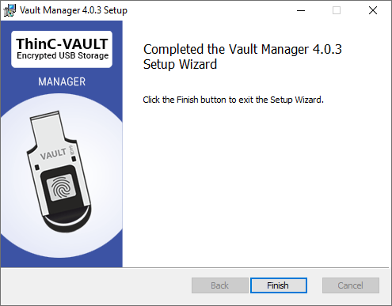

VAULT Manager tool is a software utility required for registering the fingerprints, partitions and managing permissions to the partitions. To utilize the device the following steps has to be followed,
    
* Register / Enroll fingerprint biometrics using VAULT Manager Tool 
* Create partition and assign permissions.
      
###  Installation procedure

Step 1: Open the downloaded file to begin the installation wizard. 

{}
  During the installation process in Microsoft&copy;  Windows&copy;  8.1 / Windows&copy;  10 or above, it is possible that Microsoft Smart Screen protector may pop up window for permission. Kindly choose to provide necessary permissions by selecting 'Run Anyway' (or equivalent).
{}

{}
  It is possible that the User Access control / Antivirus / End Point Protector software could request you to approve the installation of the software. Kindly choose to permit any such request that may be popped up during installation.
{}

 

 

Typical window showing the downloaded installer tool in Microsoft Windows 10 operating system. 

Step 2:
After opening ThinC Manager tool installer, license agreement window will be shown. Please read the Ensurity Software Applications - End Users License Agreement completely and choose to accept by selecting on "I accept the terms in the License Agreement" and click on Install to proceed further with the wizard. Choosing cancel any time during the installation process will abort the installation. 

 

Step 3: 
The Installation window will show progress of installation. Once the installation process is initialized this process can't be stopped / aborted. If installation is stopped or aborted tool will not be installed. 

Step 4: 
After the installation is successfully completed, click on Finish to complete the installation

Use desktop shortcut or start menu shortcut or navigate to install path to run ThinC Management tool.

In case of any issue or error during the installation, please contact support at thinc.support@ensurity.com or visit us on ensurity.com for technical support.