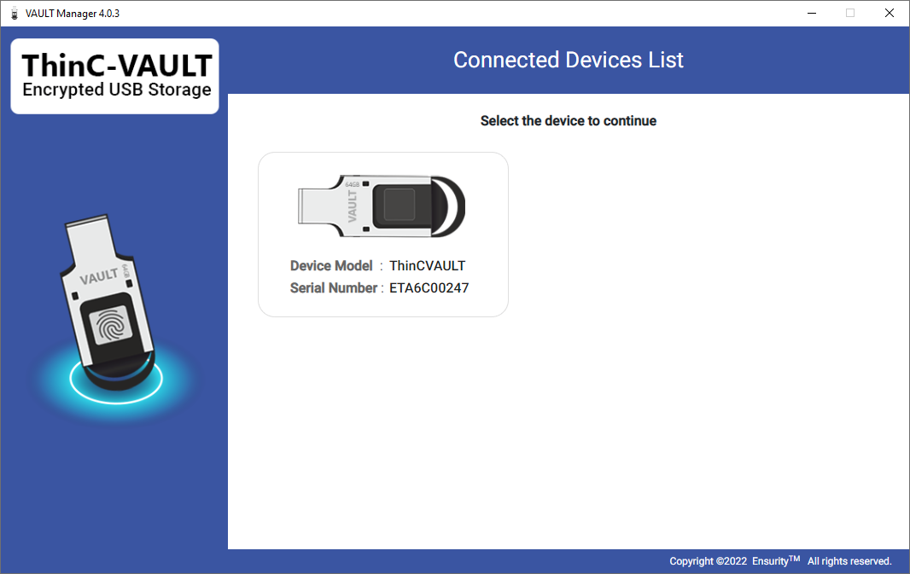
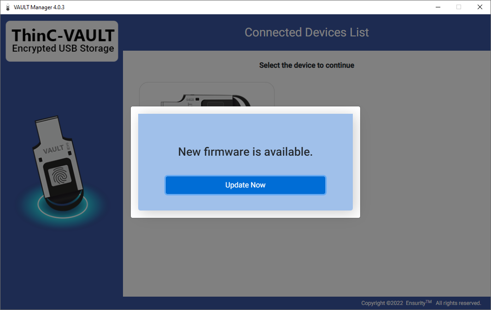
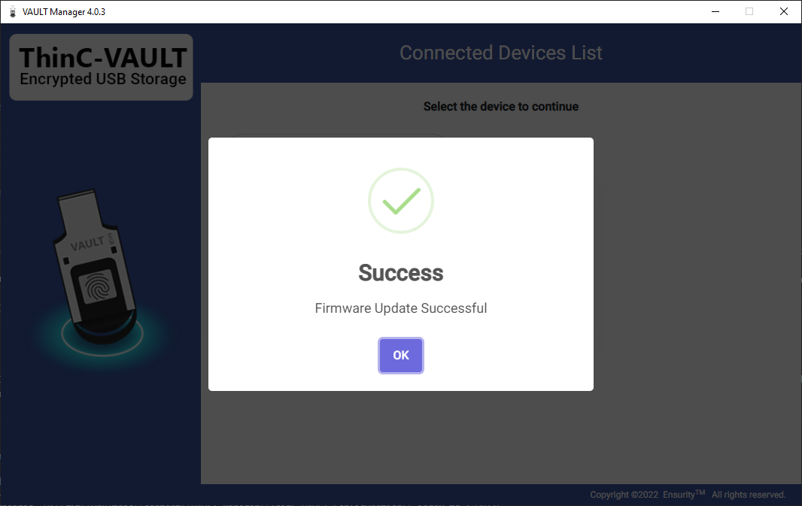
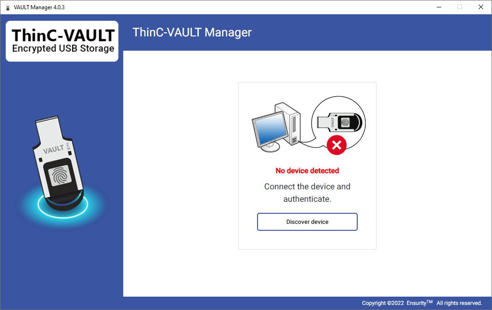

VAULT Manager is a standalone management tool to administer ThinC devices/s partitions, fingerprint enrolment, binding etc. Ensure that tool is installed in required computer before proceeding further [refer to installation section in the manual for installing].

This tool is used for managing ThinC-VAULT. Connect the ThinC-VAULT to computer USB port, the device would power on, initialize and install necessary drivers automatically and await to read fingerprint or enroll fingerprints. 

<h5 class="alert-heading">Note</h5>
For a fresh/new device, upon connecting to the computer USB port a Public drive of 500MB will automatically initializes.

The ThinC-VAULT device has two types of users. 

1) Admin User (AU)
2) End User (EU)

## Admin User Functionalities

The following are the functionalities that the Admin User can perform

<b>Basic Functionalities</b>

* Create / Delete Users 
* Create / Delete / Modify Groups
* Register / De-Register Users fingerprints. 
* Set / Edit / Manage Partitions
* Manage Device Settings

<b>Advanced Functionalities </b>

* Set / Edit / Manage Access Rights
* Set / Edit / Manage Passwords
* PC Binding

## End User Functionalities
 
The following are the functionalities that the User can perform

<b>Lock / Unlock Partitions</b> 
<b>Bind / UnBind</b>

> **_Note:_** <i>Refer to LED Indication table to understand different device states. </i> 
<i>While the device is initializing, do not place your finger on the fingerprint sensor.</i>

## Device Configuration

* Open VAULT Manager tool, the tool will automatically search, recognize and list connected ThinC-VAULT devices. Click on the device that needs to be managed.

* If the firmware in the device is upto date the application will login, else a mandatory pop up is diplayed to update the firmware. Click on "Update Now". 

* After successfull updation, click on "Ok".

* If the device is not connected properly or not available in computer, the below screen would be displayed prompting the user to reconnect the device. If it continues to be unrecognized device, please contact thinc.support@ensurity.com.

<i>Note: ThinC-VAULT device supports up to 15 fingerprint registrations. </i>